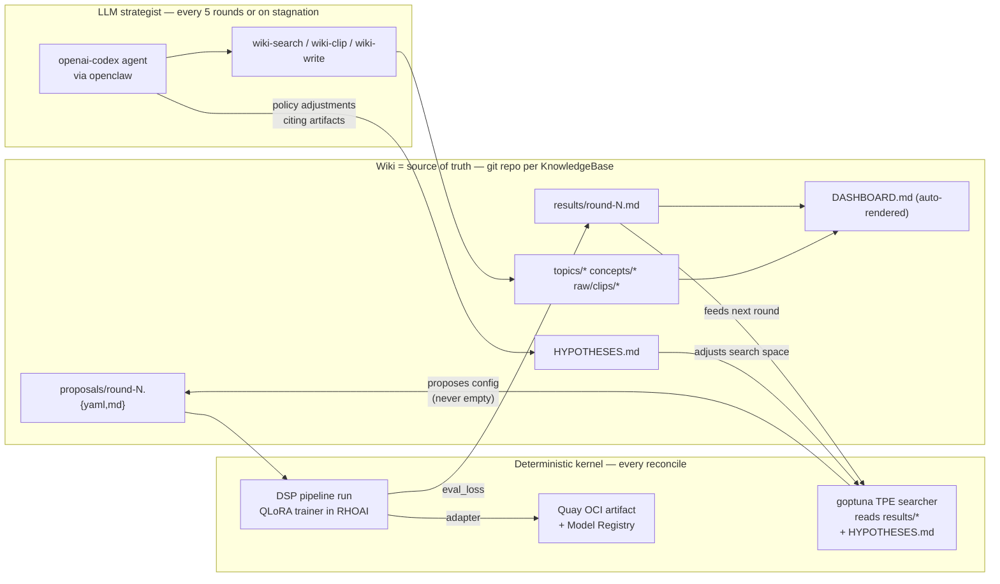

# Agent Office Operator

OLM-managed OpenShift operator for the **Governed Agent Platform**.

Owns seven CRDs in the `agentoffice.ai` API group:

| CRD | Role |
|-----|------|
| **`AgentGateway`** (`agw`) | One OpenClaw runtime hosting one-to-many `AgentWorkstation`s as logical agents. Pairs with a node-host, browser profile, and Codex subscription. |
| **`AgentWorkstation`** (`aw`) | One governed coding-agent instance — the cluster representation of "one seat in the office". |
| **`MemoryModule`** (`mm`) | Shared `.md` content (`AGENTS.md`, `USER.md`) referenced by one or more `AgentWorkstation`s with content-hash + referenced-by indexing. |
| **`Skill`** (`sk`) | A reusable `SKILL_<name>.md` per the Anthropic Skills Open Standard. Bound to agents via `SkillBinding`. |
| **`SkillBinding`** (`skb`) | Grants one `Skill` to one or more `AgentWorkstation`s. Renders `SKILL_<name>.md` into the agent's per-agent `ConfigMap`. |
| **`KnowledgeBase`** (`kb`) | A wiki PVC bound to a gateway, optionally git-mirrored. Where curated knowledge lives + where autoresearch projects deposit history. |
| **`AutoResearchProject`** (`arp`) | A Karpathy-style autonomous QLoRA fine-tuning loop. The deterministic kernel of the autoresearch flywheel — see below. |

The operator follows the AAIF (Agentic AI Foundation, Linux Foundation,
December 2025) cross-tool conventions for `AGENTS.md` and the Anthropic
Skills Open Standard for `SKILL_<name>.md` packaging.

It ships a **ConsolePlugin** that adds `MemoryModule` and `AgentWorkstation`
tabs to the operator's CSV detail page in the OpenShift Console, and an
HTTP `/catalog` endpoint that exposes every reconciled agent + KB + auto-
research project to Backstage's `catalog-info.yaml` importer.

## How the autoresearch flywheel works

`AutoResearchProject` is the operator's most opinionated CRD — it
encodes a Karpathy-style autonomous hyperparameter-search loop with
a clean separation between the deterministic kernel (always turns)
and the LLM enrichment layer (runs on cadence).

### The two-clock architecture



### Two clocks, one wiki

The flywheel runs at two cadences that meet at the wiki:

- **Round clock** (every `cadenceMinutes`, default 30): the deterministic
  searcher proposes the next config via [goptuna](https://github.com/c-bata/goptuna)
  TPE, the operator commits `proposals/round-N.{yaml,md}` + re-renders
  `DASHBOARD.md` in one atomic `wiki.Transaction`, training fires on
  RHOAI Data Science Pipelines, results land back in the wiki on
  completion. The searcher cannot return empty — even with zero
  history it falls back to Random sampling. The kernel turns even
  with no LLM, no Codex token, no network.

- **Strategist clock** (every 5 completed rounds OR when no eval-loss
  improvement in 3 rounds): an openai-codex agent runs via openclaw
  with the wiki-search / wiki-clip / wiki-write skills bound to it.
  It clips relevant papers, files synthesis articles into `topics/`,
  and updates `HYPOTHESES.md` — a YAML doc citing the curated
  artifacts that the searcher reads on its next round to bias TPE
  toward promising regions of the search space. **The strategist is
  off the critical path** — if it fails, the round still runs.

### What gets written where

| Path | Owner | Cadence | Source |
|------|-------|---------|--------|
| `proposals/round-N.yaml` | operator | every round | searcher output |
| `proposals/round-N.md` | operator | every round | human-readable summary of the proposal |
| `results/round-N.md` | operator | round completion | DSP pipeline output |
| `log/log.md` | operator + strategist | both | append-only chronological feed |
| `HYPOTHESES.md` | strategist | every 5 rounds + on stagnation | LLM policy doc, cites artifacts |
| `raw/clips/*.md` | strategist | per `wiki-clip` invocation | captured papers / blog posts |
| `topics/*.md` | strategist | per `wiki-write` invocation | curated syntheses |
| `concepts/*.md` | strategist | per `wiki-write` invocation | canonical concept pages |
| `DASHBOARD.md` | operator | every round | auto-rendered from above |

Every wiki write goes through one atomic `wiki.Transaction` helper
(clone → write → commit → push) using a GitHub App installation
token. Failures surface loudly as `WikiSyncOK=False` on the
`AutoResearchProject` status — no silent best-effort.

### Status conditions

The `AutoResearchProject` CR carries first-class observability:

- `SearchAlive` — the searcher produced a config this reconcile
- `WikiSyncOK` — the last wiki transaction committed and pushed
- `StagnationDetected` — best eval_loss flat for ≥ `defaultStrategistOnStagnation` rounds (will trigger the strategist next reconcile)
- `StrategistOK` — the strategist's last turn produced a valid `HYPOTHESES.md`
- `AgentIntegrationOK`, `AdapterPushOK`, `PipelineUploadOK`, `ModelRegistryAvailable`, `Ready` — the rest of the pipeline

### How a single round plays out

```
Reconcile (every ~cadenceMinutes)
├── 1. begin wiki.Transaction         (clone via GitHub App)
├── 2. backfill missing history       (idempotent; runs once per project)
├── 3. load results/* into searcher   (TPE replays observations)
├── 4. apply HYPOTHESES.md            (search-space adjustments)
├── 5. maybe run strategist           (gated by cadence + stagnation)
├── 6. searcher.Suggest()             (NEVER empty — Random in warmup, TPE after)
├── 7. write proposals/round-N + DASHBOARD.md
├── 8. atomic commit + push           (one git op for the whole turn)
└── 9. submit DSP pipeline run        (RHOAI Data Science Pipelines)

… training takes whatever time GPUs + dataset + steps need …

Next reconcile
├── 10. drain completed run           (scrape AUTORESEARCH_RESULT= from pod logs)
├── 11. write results/round-N.md + log entry
├── 12. push adapter to Quay (OCI modelcar)
├── 13. register ModelVersion in RHOAI Model Registry
└── 14. → round N+1 fires
```

The pre-v1.0.0 architecture had the LLM on step 6 (the proposal
critical path). When the LLM was sick the loop fell back to a
single hardcoded "starter config" — train the same config 100
times in a row, no learning. The v1.0.0 refactor moved the LLM
to step 5 (off the critical path) and replaced step 6 with the
deterministic searcher. The wiki is now a real knowledge base
that accumulates project-specific domain expertise over months,
not just a transactional log.

See `internal/search/` for the searcher implementation and
`internal/controller/autoresearchproject_strategist.go` for the
strategist runner.

## Build pipeline

Three Tekton PipelineRuns in `.tekton/`, all triggered by Pipelines-as-Code
on push to `main`:

| Pipeline | Output |
|---|---|
| `operator-image-on-push.yaml` | `quay.../agent-office-operator:v0.0.1` |
| `operator-bundle-on-push.yaml` | `quay.../agent-office-operator-bundle:v0.0.1` |
| `operator-catalog-on-push.yaml` | `quay.../agent-office-operator-catalog:v0.0.1` |

OLM's `registryPoll` on the `CatalogSource` detects digest changes behind
the stable tags every 5 minutes, so the tile in **Ecosystem Software
Catalog** auto-updates without ArgoCD Image Updater wiring.

## Related repos

- [`agent-office`](https://github.com/enterprisewebservice/agent-office) —
  the office UI (Map / Discord / WebRTC) and (legacy) Go backend.
- [`agent-office-memory-modules`](https://github.com/enterprisewebservice/agent-office-memory-modules) —
  shared `.md` content for the `MemoryModule` CRs the operator manages.

## License

Apache 2.0.
